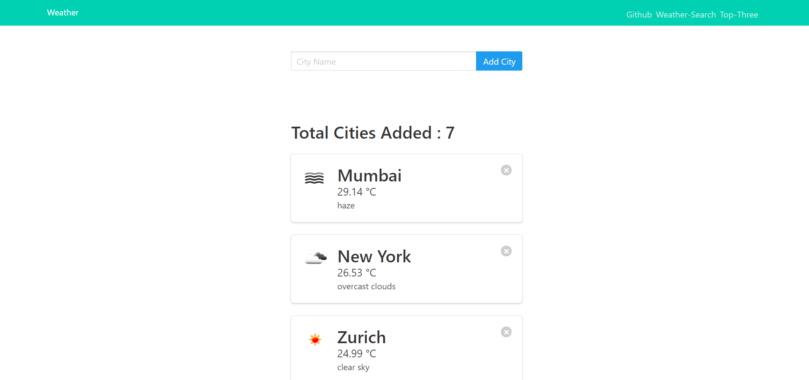

# Django App

> A Django Web App made using OpenWeatherMapAPI and GITHUB API to fetch data and display it on the basis of the user's search. 

> Weather Web Part allows the user to search weathers of different countries and add them to the favourites which can later be viewed with updated data.It also features a part where you can search any city in the world to check their weather without saving them.We can also view the top three most searched cities with their weather information. 

> Github Web Part allows you to search github users based on their usernames and it fetches the image,name,repositories,followers and following and other relevant information. 

> This Web App is mainly made to use and practice using APIs with Django. 

# Overview Of The Website

Task 1,2

 

Weather-Main

 

Weather-Search Any

 

Weather-Most Searched

 

Github

 
 

> Clone the repository. 
> Install django and other required dependencies.Also make sure to have installed Python and Pip. 
> Run npm start in the command line to run the website on local host.

## App Info

### Author [Yash Jhaveri](https://www.linkedin.com/in/yash-jhaveri-3b0882192/)
